# kdtreePathTracerOptimization
KD tree optimization for path tracing

University of Pennsylvania, CIS 565: Final Project Fall 2016 
Rony Edde

### K-D Tree optimizations for path tracer
This is KD-tree implementation for accelerated path tracing.  
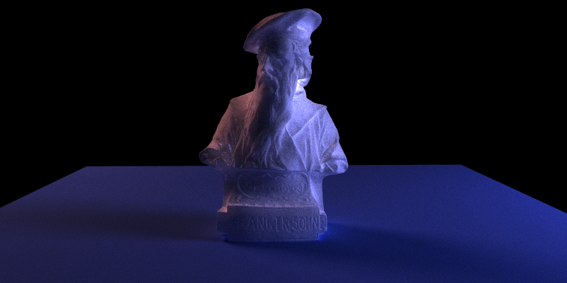

* Controls
  * Esc to save an image and exit.
  * S to save an image. Watch the console for the output filename.
  * Space to re-center the camera at the original scene lookAt point.
  * A for enabling / disabling anti-aliasing.
  * 0 for resetting depth of field to zero focal length and zero blur.
  * - for decreasing depth of field.
  * = for increasing depth of field.
  * [ for decreasing focal length.
  * ] for increasing focal length.
  * C for enabling / disabling ray caching and sorting (disbled by default).
  * X for enabling / disabling subsurface scattering (only materials with sss).
  * F for enabling / disabling stream compaction and ray sorting by material.
  * T for enabling / disabling benchmark tests.
  * 1 reduce soft reflections/refractions.
  * 2 increase soft reflections/refractions.
  * B for enabling / disabling bounding box optimization (only when kd disabled).
  * K for enabling / disbling KD tree optimization.
  * V for visualizing the KD tree.
  * L for enabling / disabling short-stack traversal (when KD is enabled).
  * Keyboard up shifts the camera up.
  * Keyboard down shifts the camera down.
  * Keyboard left shifts the camera left.
  * Keyboard right shifts the camera right.
  * Left mouse button to rotate the camera.
  * Right mouse button on the vertical axis to zoom in/out.
  * Middle mouse button to move the LOOKAT point in the scene's X/Z plane.

* Building the project
   * Create a build directory.
   * cd ./build
   * run cmake gui up a directory: cmake-gui ../
   * make sure the CUDA SDK path is correct (you need to find the path to the SDK).
   * Configure.
   * Build.
   * in windows you can run "explorer *.sln" to open the project.
   * in Solution Explorer right-click on kdtreePathTracerOptimization select Set as StartUp Project.
   * Ctrl+F5 builds and runs the code.
   * You will not see anything initially because you need to supply a scene file and / or an obj file.  
   There are 2 ways of doing this, either in the command line like so:  
   ./kdtreePathTracerOptimization.exe ../../scenes/cornell9.txt ../../scenes/dragon_5.obj  
   Alternatively you can do this in Visual Studio like so:  
   In the Solution Explorer, Right-click on kdtreePathTracerOptimization select properties.
   properties->debugging, under Command Arguments add the following: 
   ../scenes/cornell9.txt ../scenes/dragon_5.obj  
   * Ctrl+F5 should run and load the scene with the obj.
   * Obj files need to have materials, normals and uv coordinates otherwize they cannot be loaded. 

### Intro
Shooting rays through a complex scene with a large number of
polygons can be heavy and exponentially slow even on the GPU.  Axis
Aligned Bounding boxes help improve performance, however this still
doesn't solve the problem when rays intersect a complex object with
millions of triangles.

Using a K-D Tree to represent the triangles reduces the overall
complexity of the lookup and the time needed to find the
intersecting triangles.  There is a cost of computation for
generating the KD-Tree but in most cases the scene is mostly static
geometry which should benefit from this data structure.

 (image from wikipedia)

* Path tracing hurdles.
Complex geometry tends to take a lot of memory.  The current path
tracer is unable to load complex geometry and crashes when the limit
is reached.  GPUs don't have enough memory to compete with CPUs 
and a typical path tracer loading millions of triangles can easily crash
the graphics card.  Just accessing the entire geometry without an optimized data structure can be close to impossible without resorting to optimizations.  However, even after optimizations, this can remain a major issue with high risks of overwhelming the GPU memory and resulting in a crash.  To solve this, we must resort to streaming.  If the object loaded has 1 million triangles, it would require 192MB of GPU memory on a 64 bit machine.  In today's applications and games 1 million polygons is considered low resolution.  We can see how this quickly becomes an issue.

* Streaming alone, however presents additional complexities for optimization.  KD-Trees will need to be adaptive and fast in order to account for this.  Another option is to split the complexity in sub-trees in order to fit in memory, thus reducing the impact caused by streaming. This could have an impact on the benefit of using KD-Trees and can also present issues when rendering double sided geometry.

### Development Process
* Initial tentative road map
The project will consist of coming up with and implementing a K-D Tree that solves these issues with CPU and GPU generation.

* KD-tree implementation progress 1
Currently building the main KD-Tree library in rnd as a stand alone library.  The current implamentation uses the following data astructures.
  * Triangle:  
  This hold the data what will represent the mesh triangles in the path tracer.  The path tracer will have to adapted in order to pass in triangle data instead of the usual point positions.
  The Triangle contains centroid information as well as bounds, the is needed for leaf nodes.  Centroid information may be discarded in the future.
  * BoundingBox:  
  This contains bounding information as well as a helper to compute bounds and centroids for triangles.  This does not contain any triangle information as it is not necessary for intermediate nodes.
  * KDnode:  
  This is where all the logic resides.  Currently the building and accessing of the tree is possible.
    * The core implementation functions not including trivial helpers:
      * split(): splits the tree with the specified depth. This is useful for limiting the number of level to avoid going as far as a leaf per triangle as this may not be the most efficient configuration.
      * updateBbox() and mergeBbox() for adding triangles and updating the node bounds when merging with other boundingboxes.
      * deleteTree() for clean memory management.
      * printTree(), printTriangleCenters() for printing the tree contents as a sanity check.
      * getDepth(), getLevel() for checking node level and the depth from a node to a leaf.

  * This setup is being tested with a custom SideFX Houdini binding for verifying and validating the results.  This binding saves the triangles of any object from Houdini to a file.  The file is then read by the KD-Tree class which splits the data and writes out the tree to a file.  The generated file is then read in Houdini where the bounding hierarchy is displayed using a custom library build as a Houdini Python SOP node.

  * Houdini visualization network.  
  

  * Bugs are not trivial to track down.  At first the tree was going deeper than expected with duplication along the way.  Also, resizing the bounds introduced an offset which moved the splitting plane.  This is easy to see now that the setup is in place. Degugging a lot easier.  The initial results look promising despite the offset which was rectified later on.  
  
  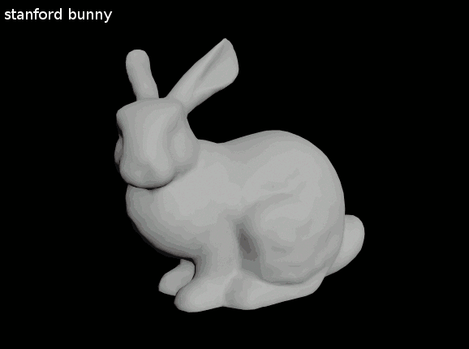

  * Result of a one branch traversal seem to be working (notice the splitting place offset bug).  
  

  * Next milestone was to generate and traverse the tree using loops and correcting the bound resizing.  Removing all recursion is not trivial, nor is it cleaner but it's necessary for CUDA because of the lack of recusrion and the non dynamic memory allocation needed for optimization.

  * Implementation update 1.  
  KD implementation on the way.  Managed to preview sections of the tree in the path tracer.
  The results are starting to look promising despite the disabled shading.  It's now possible to see the bounding regions from the initial implementation.  Still not fully implemented but visibly sectioning the geometry which was the initial intention.  
  * Getting there one step at a time:  
  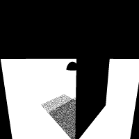
  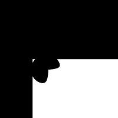

  * Implementation update 2.  
  Finally managed to get the entire geometry to get traversed using a non recursive solution.  This is not ideal but it's still quite a lot faster than using one bounding box.  It's not complete yet but the results are stating to look promising.  The data structure in place was flattened to compensate the lack of recursion in CUDA.  Here's the stanford bunny with a little over 200k vertices:  
  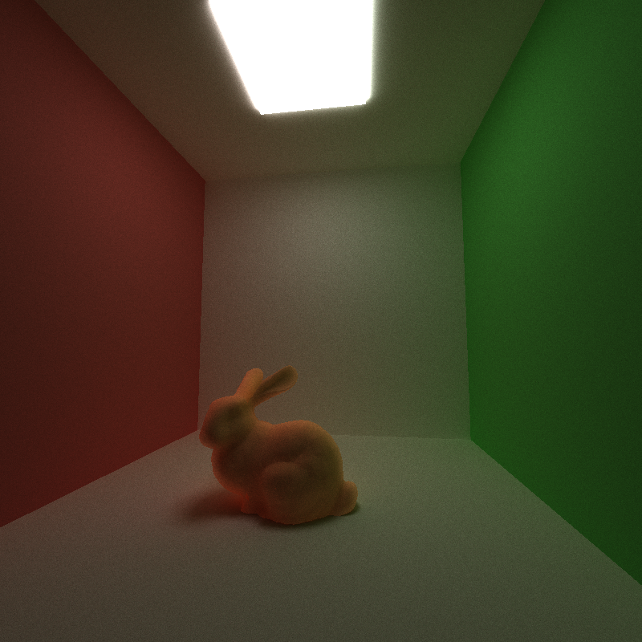
  
  * Data structure changes:  
  Instead of keeping a node data structure which can be nested, there were some important modification to allow non recursive GPU calls.  The node data structure was flattened by decoupling the node structure and traversal from the geometry.  There are now 2 types of pointers being stored separately with a lookup index and offset to the polygonal data.  KDnode and KDtriangle are the flattened versions that are allocated for the tree traversal.  
  This however meant that the data structures stored information for building the tree and that would potentially have an impact on the limited GPU memory, so reducing the size was necessary.  Traversing the tree required indexing only so data reduction was straighforward.  
  The result is 2 data structures: NodeBare and TriBare with the following sizes:  
  NodeBare: 64 / TriBare: 76.  
  The original KDnode and KDtriangle classes used respectively 136 and 116 Bytes.  
  Resulting in using 47% and 65% memory from the initial KDnode and KDtriangle memory respectively.  

  * Implementation update 3.
  Now that the code is a bit more stable, I've decided to go a step further and implement a short stack tree traversal method described in this paper by Daniel Reiter Horn Jeremy Sugerman Mike Houston and Pat Hanrahan: [Interactive k-D Tree GPU Raytracing](https://pdfs.semanticscholar.org/cd1d/d45dcee7c44a513befd3e00b6dfc3b34ee95.pdf).  
  The first issue was to deal with the lost nodes.  This was due to the nodes that are skipped prematurely which is when the algorithm shifts back to a standard stackless traversal.  This was less than desirable and introduced complexity that needed to be addressed.  Here's the initial failed approach:  
    
  Comparing this to the stackless approach which worked well:  
  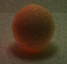  
  
  * How to fix this efficiently without resorting to additional  complexity?  
  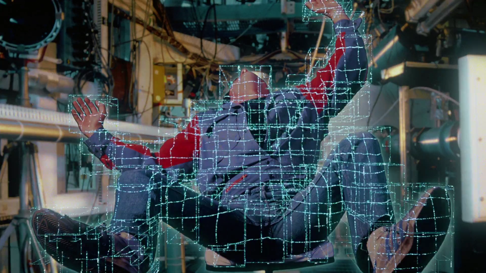  
  Image from Tron (copyright Disney)  

  * Going back to stackless traversal we have to visit all the nodes that intersect the ray regardless of the bounds.  This is a safe approach but can be inefficient when the ray already hit the closest split plane.  Here's an illustration of the traversal.  Square nodes represent leaf nodes which contain geometry.  The red node represents the location of the closest triangle that the ray is supposed to hit correctly.  The traversal in the naive approach is illustrated below:    
    
  * In order to prevent reviting nodes that are farther, the short-stack implementation is the most sensible approach.  We check to see if the left or right node is closer to the ray on the division axis.  If the left node is closer, we push the right node to the stack and start working on the left node.  
  But rather than implementing a standard short-stack, I went with a hybrid approach which uses the short stack logic but instead of leaving the nodes that are farther away to revisit, there is an additional check that "tags" the far node if collision has occured with the closest node, effectively removing all undelying nodes and reducing the number of nodes needed to be traversed.  Here's an illustration of how that works:    
  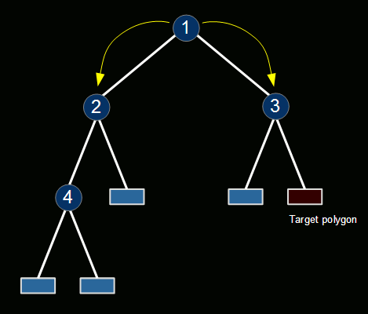  
  Notice how half the tree is ignored.  
  * Testing the algorithm on heavy geometry:  
  The following tests were conducted on heavy geometry taken from[TurboSquid](http://www.turbosquid.com)  
  * Cornell Dragon with 300k vertices (5000 iterations)  
  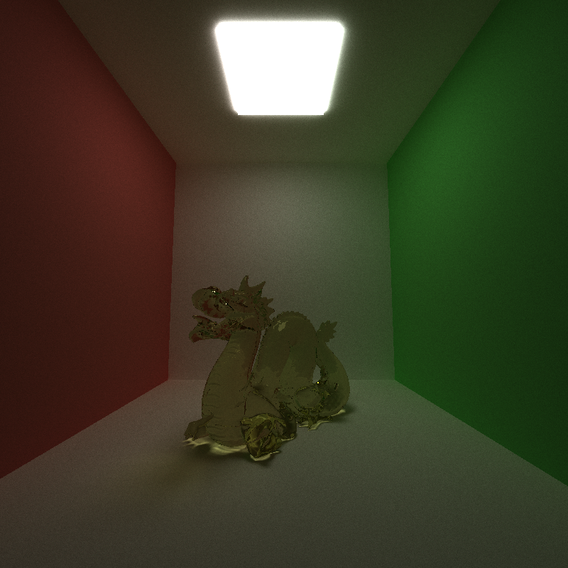 
  * Dragon with a different scene an over 8600 iterations.  
   

  * Audi R8 with over 1.69 million vertices (30000 iterations)  
  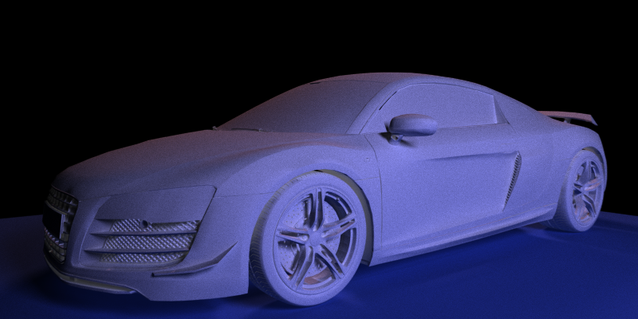 
  * Back view with 15000 iterations.  
  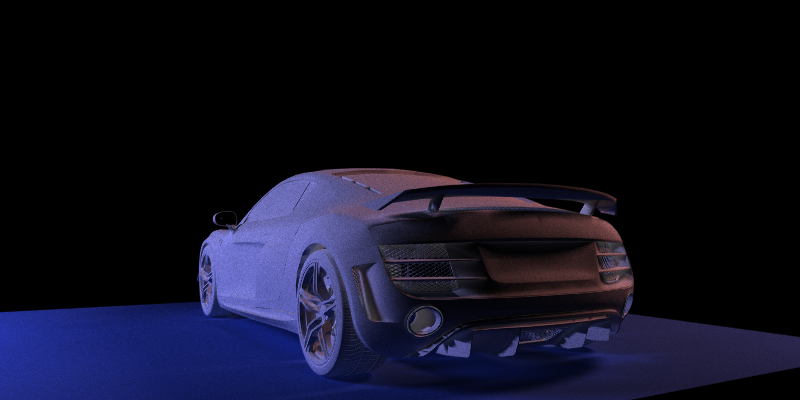

  * Predator with 828k vertices and 5000 iterations.  
  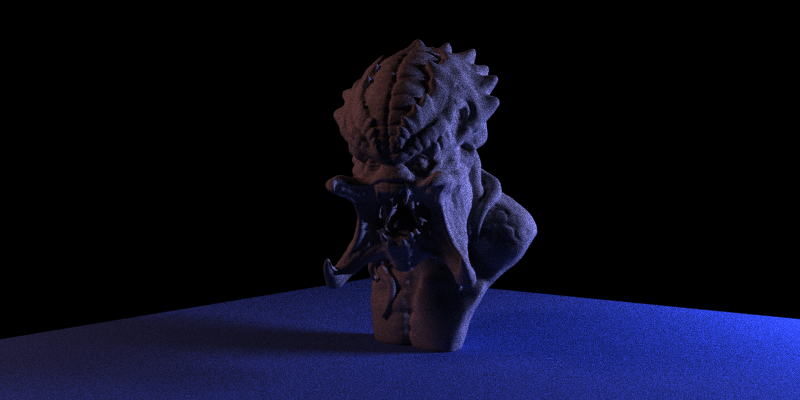
  * With subsurface scattering and a different color.  
  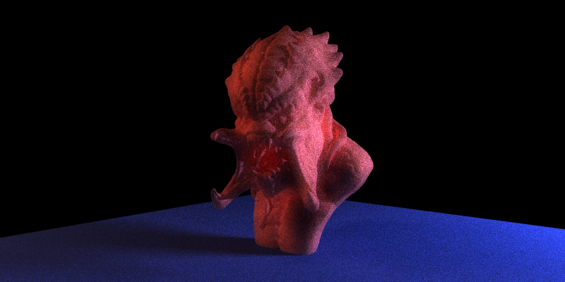

  * The heaviest test.  Gutenberg with over 3 million vertices and 15000 iterations.  
  

  * Some debug views for tree visualization:  
   * stanford bunny tree:  
   
   
   * predator front tree view:  
   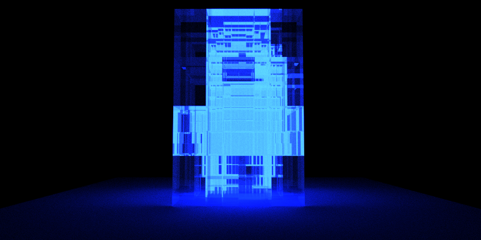
   * predator side tree view:  
   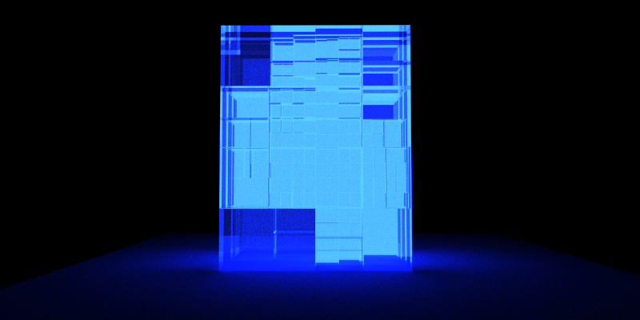

  * The Gutenberg model was the heavyest and the most interesting to test.  The scanned model is very dense which makes it an ideal candidate for testing.  Here's the wireframe views to illustrate.  
   * wireframe.  
   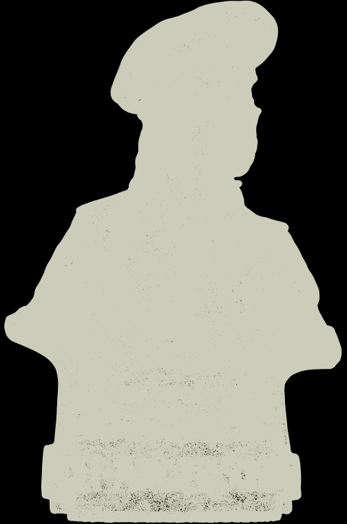
  
   * head closeup:  
   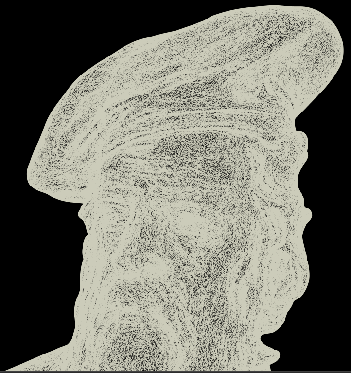

   * torso closeup:  
   

  * Performance Analysis  
   * The performance was measured with the same model across increasing resolutions.  The model used was a Stanford Dragon with 3k, 4.5k, 9k, 18.4k, 37.5k, 75k, 150k and 300k vertices.
    Here are the results:  
   *   
   We can immediately see a drastic increase in performance.  When using the bounding box only optimization or no optimizations, the scene crashed.
   That's the reason why the last entries are blank for bruteforce and bounding box.  
   Here's are the plotted curves:  
   *   
   Again we can see the failed bounding box and bruteforce methods.  The biggest increase was 10 fold for the naive kdtree traversal and 20 fold when using short-stack.  This is a great improvement over
   the standard traversal.  

   * There is obviously a slight overhead for traversing the tree.  This overhead, as minimal as it is can reduce performance over a bruteforce method when the mesh resolution is too low to justify using a kdtree.
   The model used was a simple low resolution spheren mesh with increased complexity.  The following benchmark was run on the following mesh densities: 60, 240, 540, 960, 1.5k, 2.16k, 2.94k, 3.84k vertices.  

   *   
   Notice how the performace drops when using a kdtree.  This occurs below 1.8k vertices approximately.  Notice how the bounding box optimization also converges and we see no benefit from using a bounding box when the density is around 60 vertices.
   The intersection point is around 1.8k.  Past this point using a kdtree starts to have an advantage.  The higher the complexity, the more useful the tree becomes which is expected.  
   Here's the plotted graph:  
   *   
  

   Thank you!

